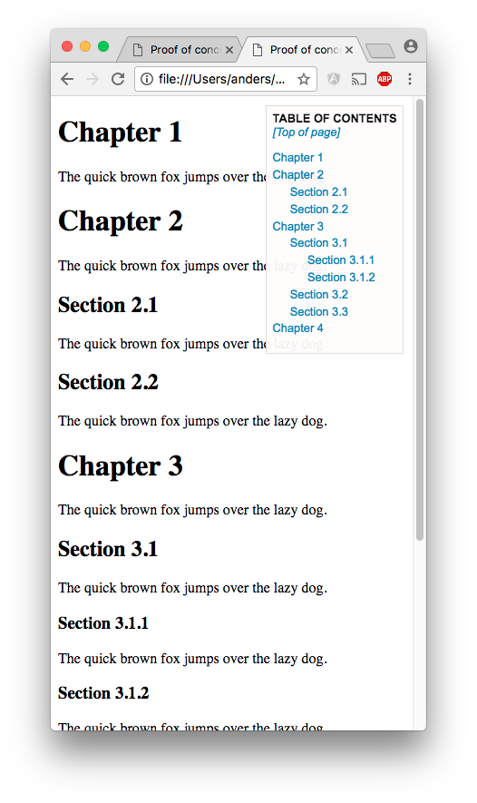

# table-of-contents

The project *table-of-contents* is Javascript functionality that generates and adds an HTML block to an existing HTML page. This added HTML block contains a clickable *Table of Contents (ToC)* built from the page's existing heading elements.


## Background

This project was started in April 2017 when I wanted a simple and elegant solution for automatically adding a clickable *Table of Contents* list for existing HTML pages.


## Files

The project consists of the following files:

```
.
├── LICENSE
├── README.md
├── css
│   └── tableOfContents.css
├── example.html
├── exampleSmall.html
├── example_tableOfContents.png
└── js
    ├── jquery-3.2.1.min.js
    └── tableOfContents.js
```

The *important* files are `tableOfContents.js` and `tableOfContents.css`. The other files are for documentation and help.


## Installing

You will need to include the `tableOfContents.js` and `tableOfContents.css` files in your HTML `head` section.

```html
<head>
    ...
    <script type="text/javascript"
            src="js/tableOfContents.js"></script>
    <link rel="stylesheet"
          type="text/css"
          href="css/tableOfContents.css">
    ...
</head>
```

You will also need the *[jQuery Core][jQuery]* (version 3.2.1 or later), which you can for example include as

```html
<script type="text/javascript"
        src="https://code.jquery.com/jquery-3.2.1.min.js"
        integrity="sha256-hwg4gsxgFZhOsEEamdOYGBf13FyQuiTwlAQgxVSNgt4="
        crossorigin="anonymous"></script>
```

or by including a local copy (there is a local copy in the js-directory)

```html
<script type="text/javascript"
        src="<your>/<path>/jquery-3.2.1.min.js"></script>
```

See for example [downloading jQuery][] and [jQuery CDN][] for details.


   [jQuery]: https://jquery.com/ "jQuery"
   [Downloading jQuery]: https://jquery.com/download "Downloading jQuery"
   [jQuery CDN]: https://code.jquery.com "jQuery CDN"


## Documentation

There are only two files that you need to know about. All the functionality is implemented within the `tableOfContents.js` file. The styling is accomplished by the `tableOfContents.css` file.

The *Table of Contents* block will be generated when the `$(document).ready()` call kicks in after the HTML page has been loaded. The Javascript function `generateTableOfContents()` will build the HTML block containing the *Table of Contents*, using information from all the HTML heading elements `h1`-`h6` found on the existing page. These elements should lie in a *plain* structure, i.e. not nested within each other or nested in other elements. For each `h1`-`h6` element, an anchor tag, for example `<a id="toc_3.1.2"></a>`, is inserted just before the heading element.


### Configuration

#### Javascript

You can alter the JS file (`tableOfContents.js`) if you need your own specific behaviour:
* If you just want to support `h2`-`h4` you can modify the constant `SUPPORTED_HEADING_LEVELS`.
* If you want to start with another element than `body`, you can modify the constant `startItem`. If you, for example, have your heading elements buried in a `div` element with the `id` attribute 'myOwnContent', you can use a startItem like `$('div#myOwnContent')`.
* If you need to see details about what is happening, you can toggle console logging via the constant `USE_LOGGING`.

#### Stylesheet

You can alter the CSS file (`tableOfContents.css`) if you need your own specific look:
* Colors.
* Font sizes.
* Positioning.
* Margins and paddings.
* Border.
* Opacity.


### The generated *Table of Contents* block

The *Table of Contents* block will, by default, be fixed to the upper right corner of your web page.

The block can be collapsed (and expanded) by clicking on the *Table of contents* label.

A link to the *Top of page* is always automatically generated.

There is some opacity to the block, so the underlying content will be slightly visible.

The generated block is appended to the DOM tree at the bottom of the `body` element. The top level outermost element in this block will be

```html
<div id="tableOfContents">
...
</div>
```

### The `tableOfContents.js` file

#### Main functionality

The entry function is `generateTableOfContents()` and the function doing most of the work is `buildSublist()`. There are also some helper functions.


##### The function `generateTableOfContents()`

Creates the top level `div` element that will be added to the `body` element in the DOM tree.

Also creates the *Table of Contents* label and the *Top of page* link.

Calls `buildSublist()` with its starting parameters.


##### The function `buildSublist()`

This function is called recursively and traverses deeper and deeper into the heading elements for each level.


### The `tableOfContents.css` file

Not much to say about it.


## Examples

### HTML page

The result of showing the `exampleSmall.html` in a browser:




### Resulting HTML block containing ToC

A trivial example of how the generated HTML can look like can be found in the `exampleSmall.html` file. There you have an HTML page that looks something like

```html
<body>

<h1>Chapter 1</h1>

<h1>Chapter 2</h1>
<h2>Section 2.1</h2>
<h2>Section 2.2</h2>

<h1>Chapter 3</h1>
<h2>Section 3.1</h2>
<h3>Section 3.1.1</h3>
<h3>Section 3.1.2</h3>
<h2>Section 3.2</h2>
<h2>Section 3.3</h2>

<h1>Chapter 4</h1>

</body>
```

The automatically generated block in the bottom of the `body` element will look like

```html
<div id="tableOfContents">
    <div id="tableOfContentsLabel" onclick="toggleTableOfContentsList()"
         title="Collapse/expand this Table of Contents block">Table of contents
    </div>
    <div id="tableOfContentsList">
        <div class="meta"><a href="#" title="Top of page">[Top of page]</a></div>
        <ol class="level0">
            <li><a href="#toc_1">Chapter 1</a></li>
            <li><a href="#toc_2">Chapter 2</a>
                <ol class="level1">
                    <li><a href="#toc_2.1">Section 2.1</a></li>
                    <li><a href="#toc_2.2">Section 2.2</a></li>
                </ol>
            </li>
            <li><a href="#toc_3">Chapter 3</a>
                <ol class="level1">
                    <li><a href="#toc_3.1">Section 3.1</a>
                        <ol class="level2">
                            <li><a href="#toc_3.1.1">Section 3.1.1</a></li>
                            <li><a href="#toc_3.1.2">Section 3.1.2</a></li>
                        </ol>
                    </li>
                    <li><a href="#toc_3.2">Section 3.2</a></li>
                    <li><a href="#toc_3.3">Section 3.3</a></li>
                </ol>
            </li>
            <li><a href="#toc_4">Chapter 4</a></li>
        </ol>
    </div>
</div>
```
A larger example can be found in the `example.html` file.

Since the `Table of Contents` block is dynamically generated, the HTML for it will not be shown when you use "Show source" in your browser. Instead you have to use "Inspect" (or something similar).

*Nemo nisi mors*